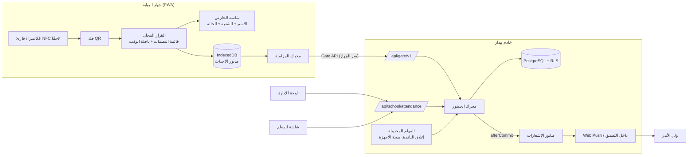
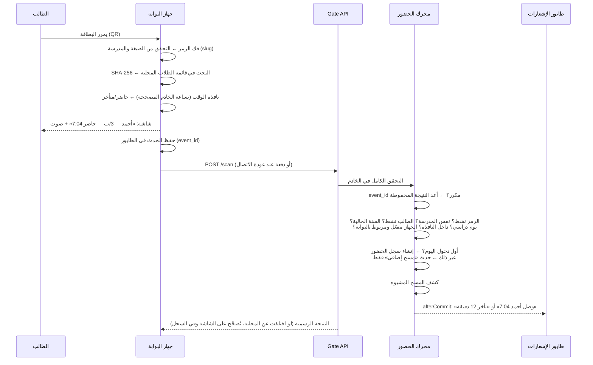
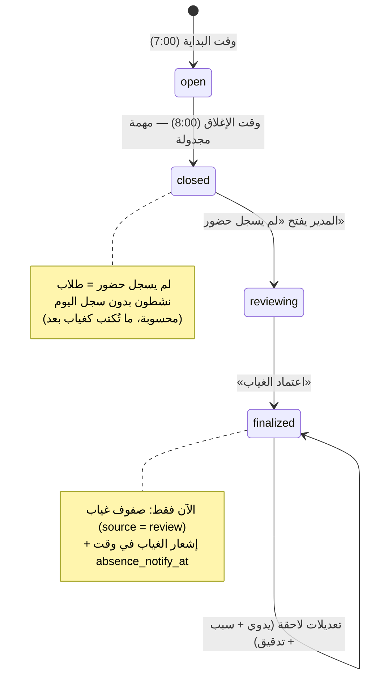
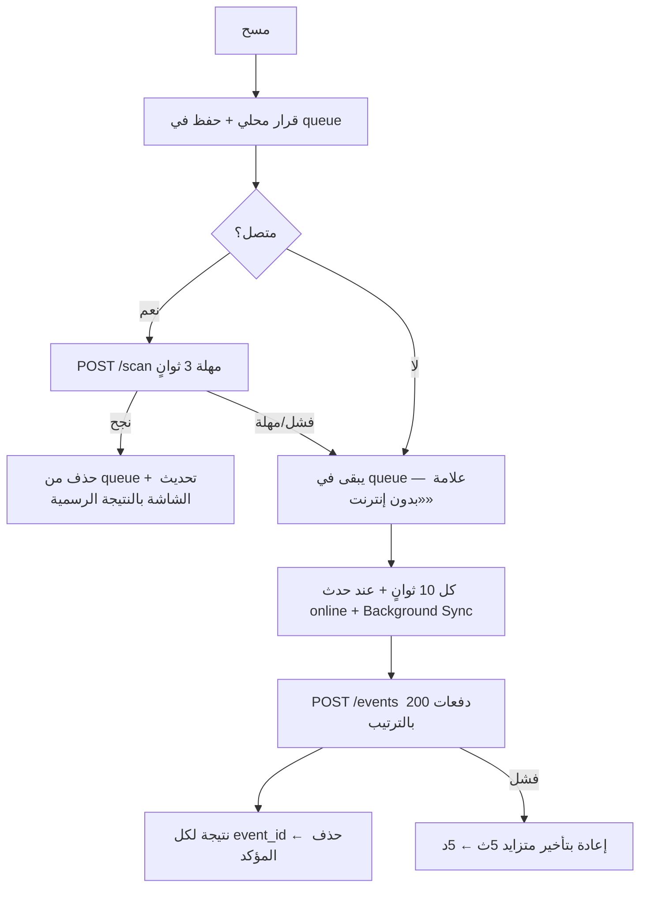

# بوابة مِدار الذكية — التصميم المعماري

> وثيقة تصميم قبل التنفيذ. تغطي: المعمارية، مسار العمل الكامل، تغييرات قاعدة البيانات والـ API،
> آلية العمل بدون إنترنت والمزامنة، الحماية من التسجيل خارج المدرسة، خطة الاختبارات، ومراحل التنفيذ.
> نبني فوق ما هو موجود: محرك الإشعارات (`notify.service.js`)، بنية المزامنة (`sync_*`)،
> الهيكل الأكاديمي (مراحل ← صفوف ← شعب)، تقويم المدرسة (`holidays` و`timetable_settings.days`)،
> وعزل المدارس بـ RLS.

---

## 0. القرارات الأساسية

| # | القرار | السبب |
|---|--------|-------|
| 1 | **رمز حضور مستقل لكل طالب** (128 بت عشوائي) غير `access_key` ولي الأمر وغير رقم الطالب | ما يمكن تخمينه، ويُلغى ويُعاد إصداره بدون ما يتأثر دخول ولي الأمر |
| 2 | **الخادم يحفظ بصمة الرمز (SHA-256)** للبحث، ونسخة **مشفّرة** (AES-256-GCM بمفتاح في البيئة) لإعادة طباعة البطاقة | تسريب قاعدة البيانات أو جهاز البوابة ما يكفي لتزوير بطاقة |
| 3 | **البوابة جهاز مسجّل، مو مستخدم.** الإدارة ترسل للحارس **رابطًا يعمل مرة واحدة** (واتساب أو QR، صالح 24 ساعة)، يفتحه على جواله فيقترن، ثم ينتظر **موافقة** المدير، ويأخذ سرًا خاصًا به | مستخدم عادي ما يقدر يحوّل جواله إلى بوابة |
| 4 | **الجهاز يقرر محليًا أولًا (Offline-First) والخادم هو الحكم النهائي** | نفس السلوك مع الإنترنت وبدونه، ورد فوري للحارس أقل من 150ms |
| 5 | **كل مسح حدث مستقل له `event_id` فريد** (UUID من الجهاز) | إعادة الإرسال ما تكرر الأثر (Idempotency)، وما يضيع شي |
| 6 | **سجل حضور واحد لكل طالب في اليوم**، والمسحات الإضافية تُحفظ كأحداث فقط | ما فيه تكرار، وما يضيع أثر أي مسح |
| 7 | **«لم يسجل حضور» حالة محسوبة، مو صفًا في الجدول.** الغياب يُكتب فقط عند **اعتماد** المراجعة | ما يوصل إشعار غياب قبل المراجعة |
| 8 | **الإشعارات تمر عبر طابور `notification_deliveries`** بعد الالتزام (`afterCommit`) | فشل الإشعار ما يوقف التحضير أبدًا |
| 9 | **الربط بالهيكل الأكاديمي عبر `student_id` فقط** | البوابة ما تكرر بيانات الصفوف والشعب، وتقرأها من المصدر المركزي |
| 10 | **طبقة «بيانات اعتماد» عامة** (`kind`: qr / nfc) واتجاه (`in` / `out`) | جاهزية لـ NFC وتسجيل الانصراف بدون إعادة تصميم |

---

## 1. المعمارية العامة



**الطبقات:**

1. **تطبيق البوابة** `/<school>/gate`: تطبيق ويب PWA مستقل بنطاق Service Worker خاص به. يعمل على الجوال والتابلت والشاشة الكبيرة، ويتحدث تلقائيًا مع كل نشر جديد.
2. **Gate API** `/api/gate/v1/*`: مصادقة بسر الجهاز فقط، بدون جلسة مستخدم. الجهاز يحدد المدرسة والبوابة، وما يُقبل `tenant` من جسم الطلب أبدًا.
3. **محرك الحضور** `attendance-engine.service.js`: هو المكان الوحيد الذي يكتب الحضور. البوابة والإدخال اليدوي والمراجعة والمزامنة كلها تمر عبره، فالقواعد واحدة: النافذة والتأخر وأولوية اليدوي والتدقيق.
4. **API الإدارة والمعلم**: الإعدادات والبوابات والأجهزة والرموز والمراجعة والتقارير.
5. **المهام المجدولة** (على `core/jobs.js` الحالي): إغلاق نافذة الحضور، تذكير المراجعة، تنبيهات صحة الأجهزة، وإصدار رموز للطلاب الجدد.

---

## 2. مسار العمل الكامل (Flow)

### 2.1 الدخول (مسح بطاقة)



**ترتيب التحقق في الخادم** (أول فشل يوقف التسجيل، والحدث يُحفظ مع سبب الرفض):

| # | الفحص | سبب الرفض المحفوظ |
|---|-------|-------------------|
| 1 | الجهاز موجود ومفعّل وغير موقوف، والسر صحيح | `device_inactive` (401 بدون حفظ حدث لو السر خاطئ) |
| 2 | الجهاز مربوط ببوابة مفعّلة | `gate_inactive` |
| 3 | صيغة الرمز صحيحة، والـ slug يطابق مدرسة الجهاز | `bad_format` / `other_school` |
| 4 | بصمة الرمز موجودة ونشطة | `unknown_token` / `revoked_token` |
| 5 | الطالب `active` (مو منقول أو مؤرشف أو منسحب) | `student_inactive` |
| 6 | فصل الطالب تابع للسنة الدراسية الحالية | `not_enrolled` |
| 7 | اليوم دراسي، مو إجازة، ومو يوم «بدون حضور» | `no_school_day` |
| 8 | الوقت الفعلي داخل نافذة الحضور (من البداية إلى الإغلاق) | `outside_window` |
| 9 | الوقت الفعلي ليس في المستقبل، والحدث بدون إنترنت ليس أقدم من الحد المسموح | `clock_invalid` / `too_old` |

**تحديد الحالة:**
- الوقت الفعلي ≤ `late_after` ← **حاضر**.
- الوقت الفعلي > `late_after` ← **متأخر**، و`minutes_late = الفرق بالدقائق`.
- للطالب حالة مسبقة اليوم:
  - **مستأذن** أو **بعذر**: تبقى الحالة ويُحفظ وقت الدخول، وما يوصل إشعار تأخر.
  - **رحلة** أو **نشاط خارجي**: تبقى الحالة، ويُحفظ الدخول للمعلومية.
- عدّل أحد السجل **يدويًا** ← البوابة ما تكتب فوقه أبدًا، وتضيف حدثًا فقط.
- وصل حدث متأخر (من جهاز كان بدون إنترنت) بوقت **أبكر** من السجل الحالي:
  - السجل يُحدَّث إلى الوقت الأبكر، وقد يتحول من متأخر إلى حاضر.
  - ما يوصل ولي الأمر إشعار ثانٍ، ويُكتب التصحيح في سجل الطالب.

### 2.2 نهاية نافذة الحضور ← المراجعة ← اعتماد الغياب



1. **عند الإغلاق** (`close_at`):
   - المهمة المجدولة تحوّل `attendance_days.state` إلى `closed`.
   - المسح بعد الإغلاق يُرفض بسبب `outside_window`. المدير يقدر يسجل يدويًا.
   - تنبيه للمدير: «لم يسجل حضور: 23 طالبًا — بانتظار المراجعة».
2. **المراجعة** (شاشة «لم يسجل حضور»):
   - القائمة مجمعة حسب المرحلة والصف والشعبة.
   - لكل طالب: الحالة المسبقة إن وُجدت، وعذر ولي الأمر إن أُرسل، وآخر مسح مرفوض إن وُجد.
   - **الاستثناءات:** يقدر المدير يحوّل طالبًا أو مجموعة إلى بعذر، أو مستأذن، أو رحلة، أو نشاط، أو حاضر (يدوي مع سبب).
3. **اعتماد الغياب**: المتبقون يُكتبون **غائب** (`source = review`، `reviewed_by`)، ويتحول اليوم إلى `finalized`.
4. **الإشعار**: يوصل ولي الأمر في وقت `absence_notify_at` من الإعدادات (مثلًا 9:00)، أو فورًا لو الوقت عدّى. ما يوصل إشعار غياب أبدًا قبل الاعتماد.
5. **خيار تلقائي** (معطّل افتراضيًا): `auto_finalize_at`، ويعتمد الغياب تلقائيًا لو ما راجعه أحد حتى وقت محدد. هذا للمدارس التي تبي ذلك صراحة.

### 2.3 الإدخال اليدوي (احتياط)

- من شاشة الإدارة، أو شاشة المعلم إذا سمحت الإعدادات.
- يمر عبر نفس المحرك: `source = manual` أو `teacher`، **والسبب إلزامي** عند تغيير حالة محفوظة.
- كل تعديل يُكتب في `attendance_audit`: من، متى، القيمة القديمة والجديدة، السبب، الجهاز وعنوان IP.
- يظهر في الواجهة بعلامة واضحة: «يدوي — بواسطة أ. خالد».

### 2.4 الإشعارات

| الحدث | المستلم | التوقيت | مفتاح منع التكرار |
|-------|---------|---------|-------------------|
| حضور | ولي الأمر | فور التسجيل (يحترم ساعات الهدوء وتفضيل «الحضور») | `arrival:<student>:<day>` |
| تأخر | ولي الأمر | فور التسجيل: «تأخر أحمد 12 دقيقة» | `late:<student>:<day>` |
| غياب | ولي الأمر | بعد الاعتماد، وفي `absence_notify_at` | `absence:<student>:<day>` |
| لم يسجل حضور بانتظار المراجعة | المدير | عند الإغلاق | `review:<day>` |
| جهاز غير متصل أثناء النافذة | المدير | بعد 10 دقائق انقطاع | `device:<id>:<day>` |
| مسح مشبوه | المدير | فورًا (مجمّع كل 5 دقائق) | `suspicious:<day>:<slot>` |

**وليّ الأمر لأكثر من ابن:** كل طالب له سجل وإشعار مستقل يحمل اسمه.

---

## 3. تغييرات قاعدة البيانات

ترحيل واحد لكل مرحلة (`0068_smart_gate_core.sql`، ثم `0069_smart_gate_offline.sql`…). كل الجداول الجديدة فيها:
- `tenant_id` مع RLS (`tenant_id = app_tenant()`).
- مشغّل التدقيق `audit_row_change`.
- إضافتها لقائمة «منطقة الخطر» بأسماء عربية.

### 3.1 بيانات اعتماد الحضور

```sql
CREATE TABLE attendance_credentials (
  id           bigint GENERATED ALWAYS AS IDENTITY PRIMARY KEY,
  tenant_id    text NOT NULL REFERENCES tenants(id),
  student_id   bigint NOT NULL,
  kind         text NOT NULL DEFAULT 'qr' CHECK (kind IN ('qr', 'nfc')),
  token_hash   bytea NOT NULL,                 -- SHA-256 للرمز (للبحث)
  token_enc    bytea,                          -- الرمز مشفرًا (لإعادة طباعة البطاقة) — qr فقط
  version      integer NOT NULL DEFAULT 1,     -- يزيد مع كل إعادة إصدار (يُطبع على البطاقة)
  status       text NOT NULL DEFAULT 'active' CHECK (status IN ('active', 'revoked')),
  issued_by    text NOT NULL, issued_at timestamptz NOT NULL DEFAULT now(),
  revoked_by   text, revoked_at timestamptz,
  revoke_reason text CHECK (char_length(revoke_reason) <= 200),
  FOREIGN KEY (tenant_id, student_id) REFERENCES students (tenant_id, id) ON DELETE CASCADE,
  UNIQUE (token_hash)                          -- فريد على مستوى المنصة
);
-- رمز نشط واحد من كل نوع لكل طالب
CREATE UNIQUE INDEX attendance_credentials_active ON attendance_credentials (tenant_id, student_id, kind) WHERE status = 'active';
```

**صيغة رمز QR:**

```
https://midar.onrender.com/q/<school-slug>/A1<token>
```

- `token`: 26 حرف Base32 (128 بت من `crypto.randomBytes`).
- `A1`: إصدار الصيغة.
- الصيغة رابط عمدًا: لو مسحها أحد بكاميرا جوال عادية تفتح صفحة تقول «هذا رمز حضور خاص ببوابة المدرسة» **بدون أي بيانات**.

**إعادة الإصدار والتعطيل:**
- **إعادة الإصدار** في معاملة واحدة: إلغاء الرمز القديم ثم إصدار نسخة جديدة (`version + 1`).
- **التعطيل**: إلغاء بدون بديل، مثلًا لبطاقة مفقودة.
- **الطلاب الجدد**: الرمز يُصدر تلقائيًا عند إنشاء الطالب.
- **الطلاب الحاليون**: مهمة «تأكد من الرموز» تصدر رموزًا لأي طالب نشط بدونها.
- **النقل أو الأرشفة**: الرمز يُلغى تلقائيًا.

### 3.2 البوابات والأجهزة

```sql
CREATE TABLE gates (
  id          bigint GENERATED ALWAYS AS IDENTITY PRIMARY KEY,
  tenant_id   text NOT NULL REFERENCES tenants(id),
  name        text NOT NULL CHECK (char_length(name) BETWEEN 2 AND 60),   -- «البوابة الرئيسية»
  location    text CHECK (char_length(location) <= 120),
  direction   text NOT NULL DEFAULT 'in' CHECK (direction IN ('in', 'out', 'both')),
  is_active   boolean NOT NULL DEFAULT true,
  geo_lat numeric(9,6), geo_lng numeric(9,6), geo_radius_m integer,      -- اختياري
  UNIQUE (tenant_id, id), UNIQUE (tenant_id, name)
);

CREATE TABLE gate_devices (
  id            bigint GENERATED ALWAYS AS IDENTITY PRIMARY KEY,
  tenant_id     text NOT NULL REFERENCES tenants(id),
  public_id     text NOT NULL UNIQUE,              -- معرّف عشوائي يُرسل في الترويسة
  gate_id       bigint NOT NULL,
  name          text NOT NULL,                     -- «تابلت البوابة 1»
  status        text NOT NULL DEFAULT 'pairing'
                CHECK (status IN ('pairing', 'pending', 'active', 'disabled', 'revoked')),
  pair_code_hash bytea, pair_expires_at timestamptz,   -- رمز اقتران لمرة واحدة داخل رابط الحارس (24 ساعة)
  secret_hash   bytea,                             -- SHA-256 لسر الجهاز (256 بت)
  fingerprint   jsonb,                             -- نوع المتصفح والنظام والشاشة (للتعرّف عند الموافقة)
  app_version   text, last_seen_at timestamptz, last_sync_at timestamptz,
  last_ip       inet, clock_skew_ms integer, pending_events integer DEFAULT 0,
  approved_by   text, approved_at timestamptz,
  FOREIGN KEY (tenant_id, gate_id) REFERENCES gates (tenant_id, id)
);
```

### 3.3 أحداث المسح (سجل غير قابل للتعديل)

```sql
CREATE TABLE attendance_events (
  id            bigint GENERATED ALWAYS AS IDENTITY PRIMARY KEY,
  tenant_id     text NOT NULL REFERENCES tenants(id),
  event_id      uuid NOT NULL,                       -- من الجهاز: يمنع التكرار
  day           date NOT NULL,
  device_id     bigint, gate_id bigint,
  credential_id bigint, student_id bigint,           -- NULL إذا الرمز غير معروف
  kind          text NOT NULL DEFAULT 'qr' CHECK (kind IN ('qr', 'nfc', 'manual')),
  direction     text NOT NULL DEFAULT 'in' CHECK (direction IN ('in', 'out')),
  client_ts     timestamptz,                         -- ساعة الجهاز
  server_ts     timestamptz NOT NULL DEFAULT now(),  -- وقت الاستلام
  effective_ts  timestamptz NOT NULL,                -- الوقت المعتمد (انظر §5.4)
  offline       boolean NOT NULL DEFAULT false,
  result        text NOT NULL CHECK (result IN ('present', 'late', 'kept', 'duplicate', 'rejected')),
  reason        text,                                -- سبب الرفض أو الملاحظة
  suspicious    text,                                -- NULL أو سبب الاشتباه
  review_state  text CHECK (review_state IN ('open', 'dismissed', 'confirmed')),
  attendance_id bigint,
  UNIQUE (tenant_id, event_id)
);
CREATE INDEX attendance_events_day ON attendance_events (tenant_id, day, id DESC);
CREATE INDEX attendance_events_student ON attendance_events (tenant_id, student_id, effective_ts DESC);
CREATE INDEX attendance_events_suspicious ON attendance_events (tenant_id, day) WHERE review_state = 'open';
-- ممنوع التعديل والحذف إلا review_state (مشغّل يرفض غير ذلك)
```

### 3.4 توسيع جدول الحضور

```sql
ALTER TABLE attendance DROP CONSTRAINT attendance_status_check;
ALTER TABLE attendance ADD CONSTRAINT attendance_status_check CHECK (status IN
  ('present', 'late', 'absent', 'excused', 'permitted', 'trip', 'activity'));
ALTER TABLE attendance
  ADD COLUMN source       text NOT NULL DEFAULT 'manual'
       CHECK (source IN ('gate', 'manual', 'teacher', 'review', 'sync', 'import', 'excuse')),
  ADD COLUMN gate_id      bigint,
  ADD COLUMN device_id    bigint,
  ADD COLUMN first_in_at  timestamptz,
  ADD COLUMN last_out_at  timestamptz,                 -- للانصراف لاحقًا
  ADD COLUMN minutes_late smallint CHECK (minutes_late >= 0),
  ADD COLUMN offline      boolean NOT NULL DEFAULT false,
  ADD COLUMN reviewed_by  text;
```

**خريطة الحالات في المواصفة:**

| الحالة في المواصفة | التمثيل |
|--------------------|---------|
| لم يسجل حضور بعد | محسوبة: طالب نشط بدون صف اليوم |
| حاضر / متأخر / غائب / بعذر | `status` |
| مستأذن / رحلة / نشاط خارجي | `status` (قيم جديدة) |
| يدوي | `source IN ('manual','teacher')` بشارة واضحة |
| يوم استثنائي | `attendance_days.mode` (§3.5) |

**الشاشات والتقارير الحالية:**
- كل ما يقرأ `present/absent/late/excused` يستمر يعمل.
- الحالات الجديدة تُضاف للعرض والتقارير. والحالات الثلاث «مستأذن» و«رحلة» و«نشاط» ما تُحسب غيابًا في النسب.

### 3.5 الأيام والإعدادات

```sql
CREATE TABLE attendance_days (                     -- حالة كل يوم + الاستثناءات
  tenant_id   text NOT NULL REFERENCES tenants(id),
  day         date NOT NULL,
  mode        text NOT NULL DEFAULT 'normal' CHECK (mode IN ('normal', 'custom_hours', 'no_attendance')),
  open_at time, late_after time, close_at time,   -- لأيام الاختبارات مثلًا
  state       text NOT NULL DEFAULT 'open' CHECK (state IN ('open', 'closed', 'finalized')),
  closed_at timestamptz, finalized_by text, finalized_at timestamptz,
  absence_notified_at timestamptz,
  note        text,
  PRIMARY KEY (tenant_id, day)
);

CREATE TABLE attendance_audit (                    -- سجل مقروء لكل تعديل يدوي
  id bigint GENERATED ALWAYS AS IDENTITY PRIMARY KEY,
  tenant_id text NOT NULL, attendance_id bigint, student_id bigint NOT NULL, day date NOT NULL,
  actor text NOT NULL, actor_role text, old_status text, new_status text,
  old_source text, new_source text, reason text, ip inet, user_agent text,
  at timestamptz NOT NULL DEFAULT now()
);
```

**الإعدادات** تحت قسم `attendance` في `feature-settings` الحالي، وتظهر في «الإعدادات ← الحضور والانصراف»:

```js
attendance: {
  open_at: "07:00", late_after: "07:15", close_at: "08:00",
  absence_review: "manual",            // manual | auto
  auto_finalize_at: null,              // "09:30" لو absence_review = auto
  absence_notify_at: "09:00",
  notify_present: true, notify_late: true, notify_absent: true,
  teacher_can_edit: false, teacher_can_excuse: true,
  offline_max_hours: 12,               // أقدم حدث بدون إنترنت يُقبل
  suspicious_window_sec: 120,          // نفس البطاقة في بوابتين خلال هذه المدة = مشبوه
  device_offline_alert_min: 10,
  allowed_networks: [],                // اختياري: نطاقات IP لشبكة المدرسة
  require_geofence: false,
  accept_legacy_card_key: false        // فترة انتقالية لبطاقات access_key القديمة (PR #9)
}
```

### 3.6 الصلاحيات

النظام الحالي يعتمد على الأدوار (`admin`, `teacher`, `accountant`). نضيف عمود `users.permissions text[]` لصلاحيات منفصلة:

| الصلاحية | المدير | المعلم (افتراضي) | ملاحظات |
|----------|:------:|:----------------:|---------|
| `attendance.view` | ✓ | شعبه فقط | |
| `attendance.edit` | ✓ | لو `teacher_can_edit` | سبب إلزامي + تدقيق |
| `attendance.excuse` | ✓ | لو `teacher_can_excuse` | عذر أو ملاحظة |
| `attendance.review` | ✓ | — | اعتماد الغياب |
| `attendance.reports` | ✓ | شعبه فقط | تصدير |
| `gate.manage` | ✓ | — | البوابات والأجهزة والأوقات والرموز |
| `gate.security` | ✓ | — | مراجعة المسح المشبوه وسجل التدقيق |

يقدر المدير يعطي صلاحية محددة لموظف، مثل وكيل شؤون الطلاب (`attendance.review`)، بدون ما يعطيه صلاحية المدير كاملة.

---

## 4. تغييرات الـ API

### 4.1 Gate API — `/api/gate/v1` (مصادقة الجهاز)

الترويسة في كل الطلبات: `Authorization: Gate <public_id>.<secret>`. الخادم يتحقق بهذه الخطوات:
1. يبحث عن الجهاز بدالة `SECURITY DEFINER` (`gate_device_auth(public_id)`)، وترجع `tenant_id` وبصمة السر والحالة فقط.
2. يقارن البصمة بمقارنة ثابتة الزمن.
3. يفتح معاملة `transaction({tenantId})`، فيطبَّق RLS على كل ما بعدها.
4. حد طلبات لكل جهاز.

| الطريقة | المسار | الوظيفة |
|---------|--------|---------|
| POST | `/pair` | `{code, fingerprint, app_version}` ← `{public_id, secret, status: "pending"}` (بدون مصادقة، وبحد صارم لكل IP) |
| GET | `/status` | نبض كل 30 ثانية: `{status, server_time, gate, window, day_mode, roster_version, min_app_version}` ويحدّث `last_seen_at` و`clock_skew_ms` |
| GET | `/roster?since=<ver>` | قائمة البصمات (كاملة أو تغييرات فقط): `[{h, sid, name, cls, pre}]` |
| POST | `/scan` | حدث واحد مباشر ← النتيجة الرسمية |
| POST | `/events` | دفعة حتى 200 حدث (المزامنة) ← نتيجة لكل `event_id` |
| GET | `/recent` | آخر 30 نتيجة لهذا الجهاز (لاستعادة الشاشة بعد إعادة التشغيل) |

**ما يرسله الجهاز في الحدث:** `{event_id, payload, client_ts, direction, offline, local_result}`.
- يرسل الرمز الخام (`payload`)، والخادم يحسب البصمة ويتحقق بنفسه.
- `local_result` للمقارنة فقط وما يُعتمد عليه.

### 4.2 API الإدارة — `/api/school/attendance`

| المجال | المسارات |
|--------|----------|
| الإعدادات | `GET/PUT /settings` |
| البوابات | `GET/POST /gates`، `PATCH/DELETE /gates/:id` |
| الأجهزة | `GET /devices`، `POST /devices` (ينشئ رمز اقتران)، `POST /devices/:id/approve`، `/disable`، `/enable`، `/revoke`، `/re-pair` |
| الرموز | `POST /students/:id/token/reissue`، `POST /students/:id/token/disable`، `POST /tokens/ensure` (للكل)، `GET /cards?class_id=` (بطاقات للطباعة) |
| اليوم | `GET /day/:date` (الأرقام)، `GET /day/:date/unrecorded`، `POST /day/:date/close`، `POST /day/:date/exceptions` (حالات جماعية)، `POST /day/:date/finalize`، `PUT /day/:date/mode` |
| المباشر | `GET /live?after=<event_id>` (استطلاع كل 3 ثوانٍ، وSSE لاحقًا) |
| التصفية | `GET /records?date&stage&grade&class&gate&status&source&from&to&q` |
| المشبوه | `GET /suspicious`، `POST /suspicious/:id` `{state, note}` |
| التدقيق | `GET /audit?student&from&to&actor` |
| التقارير | `GET /reports?period=day|week|month|year&by=student|class|grade|stage|school|gate` + `format=xlsx|pdf` |
| الطالب | `GET /students/:id/stats?month=` (أيام الحضور، الغياب، التأخر، النسبة، متوسط التأخر) |

### 4.3 API المعلم — `/api/teacher/attendance`

- `GET /sections/:classId/day/:date`: شعبه فقط، ويتحقق من الإسناد.
- `PATCH /records/:id`: لو `teacher_can_edit`، والسبب إلزامي.
- `POST /records/:id/excuse`: عذر أو ملاحظة.

### 4.4 فحوص كل طلب (مصفوفة إلزامية)

| الفحص | Gate API | الإدارة | المعلم |
|-------|:--------:|:-------:|:------:|
| هوية المستخدم والجلسة | — | ✓ | ✓ |
| هوية الجهاز وسره وحالته | ✓ | — | — |
| المدرسة من الجلسة أو الجهاز فقط + RLS | ✓ | ✓ | ✓ |
| الصلاحية | — | ✓ | ✓ |
| الطالب تابع للمدرسة (و للشعبة للمعلم) | ✓ | ✓ | ✓ |
| البوابة تابعة للمدرسة ومفعّلة | ✓ | ✓ | — |

---

## 5. العمل بدون إنترنت والمزامنة

### 5.1 ما يُحفظ على الجهاز (IndexedDB)

| المخزن | المحتوى | الحساسية |
|--------|---------|----------|
| `device` | `public_id` والسر والبوابة والإعدادات وآخر `clock_skew` | السر محفوظ داخل نطاق التطبيق فقط |
| `roster` | `{h (بصمة), sid, name, cls, pre}` | **بصمات فقط**، ما يمكن تكوين بطاقة منها. بدون جوالات ولا صور ولا بيانات أولياء أمور |
| `queue` | الأحداث غير المرسلة | يُحذف الحدث بعد تأكيد الخادم |
| `today` | من سُجّل اليوم محليًا (لمنع التكرار المحلي) | يُمسح يوميًا |
| `log` | آخر 200 نتيجة للعرض | يُمسح يوميًا |

### 5.2 دورة المزامنة



- **لا تكرار:**
  - `UNIQUE (tenant_id, event_id)`.
  - إعادة إرسال نفس الحدث ترجع النتيجة المحفوظة بـ `ON CONFLICT DO NOTHING`، ثم يُقرأ الموجود.
  - سجل الحضور فريد أصلًا بـ `(student_id, day)`.
- **لا فقدان:**
  - الحدث يُكتب في IndexedDB **قبل** عرض النتيجة.
  - ما يُحذف إلا بعد رد الخادم بنتيجة نهائية لنفس `event_id`.
  - التطبيق يطلب `navigator.storage.persist()`.
- **الترتيب:** الدفعات بترتيب `client_ts`. والمحرك يأخذ **أبكر** وقت فعلي، فالترتيب ما يغيّر النتيجة.
- **تحديث القائمة:**
  - عند التشغيل، وكل 5 دقائق، وعند تغيّر `roster_version` في النبض.
  - تغييرات فقط بعد أول تحميل (طلاب جدد، رموز ملغاة، نقل).

### 5.3 حالات الجهاز

| الحالة | الشرط | ما يظهر |
|--------|-------|---------|
| متصل | آخر نبض ناجح < 60 ثانية والطابور فارغ | نقطة خضراء |
| يزامن | متصل والطابور فيه أحداث | نقطة صفراء + العدد |
| بدون إنترنت | فشل النبض | نقطة حمراء + «بدون إنترنت — 37 بانتظار الإرسال» |

**في لوحة الإدارة:** حالة كل جهاز، وآخر ظهور، وآخر مزامنة، والأحداث المعلقة، وفرق الساعة، والإصدار. وتنبيه المدير لما ينقطع جهاز أكثر من `device_offline_alert_min` أثناء النافذة.

### 5.4 الوقت

- **متصل:** الوقت الفعلي = وقت الخادم (`server_ts`).
- **بدون إنترنت:**
  - الوقت الفعلي = `client_ts + clock_skew_ms`، والفرق مأخوذ من آخر نبض ناجح (يُرسل مع الحدث ويُحفظ في الجهاز).
  - يُرفض لو صار في المستقبل (بهامش دقيقتين)، أو أقدم من `offline_max_hours`.
  - يُرفض أيضًا لو الجهاز ما اتصل اليوم أبدًا (ما فيه مرجع للساعة)، ويُعلّم «يحتاج مراجعة» بدل التسجيل التلقائي.
  - كل سجل بدون إنترنت يحمل `offline = true` ويظهر بعلامة في الواجهة.
- **الحسابات اليومية بتوقيت المدرسة** (`school_notify.timezone`). وكل الأوقات في القاعدة `timestamptz`.

---

## 6. الحماية من التسجيل خارج المدرسة

التسجيل يحتاج **بطاقة حقيقية** و**جهاز معتمد** و**داخل وقت النافذة**. وكل طبقة تسد ثغرة:

| # | الطبقة | ماذا تمنع |
|---|--------|-----------|
| 1 | **الرمز عشوائي 128 بت** (مو رقم الطالب) | تخمين رمز طالب أو توليده |
| 2 | **صفحة الرمز العامة ما تكشف شي** | استغلال مسح البطاقة بجوال عادي |
| 3 | **الجهاز يحتاج رابطًا من الإدارة يعمل مرة واحدة (24 ساعة) + موافقة المدير** بعد رؤية بصمة الجهاز | معلم أو طالب يحوّل جواله إلى بوابة |
| 4 | **السر لكل جهاز، يُلغى فورًا** من اللوحة. وأي طلب بعدها 401، والتطبيق يمسح بياناته | جهاز مسروق أو مفقود |
| 5 | **الجهاز مربوط ببوابة واحدة**، والبوابة يمكن تعطيلها | تسجيل باسم بوابة غير موجودة |
| 6 | **نافذة الوقت تُفرض في الخادم** (وقت الخادم أو الوقت المصحح) | التسجيل الساعة 10 أو في الإجازة |
| 7 | **اختياري: شبكة المدرسة** (`allowed_networks`). المسح المباشر من IP خارج النطاق يُعلّم مشبوهًا أو يُرفض حسب الإعداد | جهاز البوابة خارج المدرسة |
| 8 | **اختياري: النطاق الجغرافي**. الجهاز يرسل موقعه مع النبض، وخارج نصف القطر = تنبيه + تعليم الأحداث | نفس السابق (عندما ما فيه شبكة ثابتة) |
| 9 | **كشف المسح المشبوه** (§6.1) | استخدام صورة البطاقة، أو التسجيل لطالب غائب |
| 10 | **التدقيق الكامل** لكل حدث وتعديل | الإنكار، ويسهّل كشف الإساءة |

**بخصوص الخصوصية:**
- ما نستخدم بصمة الوجه ولا الإصبع.
- ما نعرض صورًا افتراضيًا.
- الحارس يشوف الاسم والشعبة والنتيجة فقط، وهذا كافٍ ليلاحظ لو البطاقة مع شخص غير صاحبها.

### 6.1 قواعد المسح المشبوه

| القاعدة | الحكم |
|---------|-------|
| نفس البطاقة في **بوابتين مختلفتين** خلال `suspicious_window_sec` | الأول يُسجَّل، والثاني يُحفظ `duplicate` + مشبوه |
| مسح برمز **ملغى** | مرفوض + مشبوه (بطاقة قديمة أو مسروقة) |
| أكثر من 5 رموز **غير معروفة** من نفس الجهاز خلال دقيقة | تنبيه (محاولة تخمين أو بطاقات مزورة) |
| حدث بدون إنترنت بفرق ساعة غير منطقي أو بدون مرجع وقت | «يحتاج مراجعة» |
| مسح من خارج الشبكة أو النطاق الجغرافي (إن فُعّل) | مشبوه |
| مسح لطالب معلّم **رحلة** أو **نشاط خارجي** اليوم | يُقبل الدخول + تنبيه للمراجعة |
| أكثر من 3 مسحات لنفس الطالب خلال 5 دقائق | تُجمّع كمسح إضافي (عادة ما يكون إساءة) |

المراجعة من شاشة «المسح المشبوه»: **تجاهل** أو **تأكيد**، والتأكيد يتيح تعديل الحضور بسبب. وكل قرار يُدقَّق.

---

## 7. الواجهات

### 7.1 تطبيق البوابة
- **ملء الشاشة**: الكاميرا في المنتصف، ونتيجة كبيرة بلون واضح (أخضر حاضر، برتقالي متأخر، رمادي سبق تسجيله، أحمر مرفوض). صوت مختلف لكل نتيجة، والشاشة ترجع للمسح بعد 1.5 ثانية.
- **الشريط العلوي:** اسم البوابة، والساعة (ساعة الخادم المصححة)، وحالة الاتصال والطابور، وعداد اليوم.
- **وضع الشاشة الكبيرة:** آخر 8 داخلين بخط كبير.
- **خارج النافذة:** «البوابة مغلقة — تفتح 7:00». وفي يوم بدون حضور: «لا يوجد حضور اليوم».
- **شاشة الاقتران** للتشغيل الأول: إدخال الرمز، ثم «بانتظار موافقة الإدارة».

### 7.2 الإدارة
- **اليوم** (لوحة):
  - الأرقام: المسجلون، حاضر، متأخر، لم يسجل، غائب، بعذر، مستأذن، رحلة.
  - نسبة الحضور، ورسم وصول بالدقائق، والحضور لكل بوابة، وحالة الأجهزة.
- **مباشر**: قائمة تتحدث كل 3 ثوانٍ (الطالب، الشعبة، الوقت، الحالة، البوابة، بدون إنترنت؟).
- **السجلات**: كل التصفيات المطلوبة.
- **لم يسجل حضور**: المراجعة والاستثناءات الجماعية، ثم «اعتماد الغياب».
- **المشبوه** و**سجل التدقيق**.
- **التقارير والتصدير**: Excel (xlsx) وPDF بالعربية من اليمين لليسار.
- **الإعدادات ← الحضور والانصراف**: الأوقات، البوابات، الأجهزة (اقتران وموافقة وتعطيل)، الشبكات والموقع، الإشعارات، الأيام الاستثنائية، البطاقات (طباعة، وإعادة إصدار، وتعطيل).

### 7.3 المعلم
- حضور شعبه اليوم مع مصدر كل سجل.
- تعديل لو مسموح، والسبب إلزامي.
- إضافة عذر أو ملاحظة.

### 7.4 ملف الطالب (الإدارة وولي الأمر)
- لكل شهر: أيام الحضور، والغياب، والتأخر، ونسبة الحضور، ومتوسط التأخر بالدقائق.
- آخر دخول مع البوابة، مثلًا «حضر من البوابة الرئيسية 7:04».

---

## 8. الأداء

- **الهدف:** 500 طالب في 30 دقيقة، أي 0.3 مسح/ثانية في المتوسط و5 مسح/ثانية في الذروة مع 3 بوابات.
- **تكلفة المسح في الخادم:**
  - 3 استعلامات مفهرسة: الجهاز، والبصمة، وإدراج أو تحديث.
  - إدراج الحدث.
  - إشعار بعد الالتزام بدون انتظار.
  - **المستهدف: p95 أقل من 150ms.**
- **الجهاز:** القرار محلي بالكامل، فالرد للحارس أقل من 150ms حتى لو الخادم بطيء.
- **عداد اليوم في اللوحة:** استعلام مجمّع على `attendance (tenant_id, day)` المفهرس. و`live` يقرأ من `attendance_events_day` بـ `id > after`.

---

## 9. خطة الاختبارات

ملف لكل مجال تحت `tests/`، بنفس أسلوب الاختبارات الحالية (قاعدة حقيقية + RLS).

**الرمز والبطاقة** `smart-gate-tokens.test.js`
- الرمز 128 بت وفريد، والبصمة تطابق، والتشفير وفك التشفير صحيحان.
- إعادة الإصدار تلغي القديم (المسح به يُرفض `revoked_token` + مشبوه).
- التعطيل يمنع المسح.
- الطالب الجديد يأخذ رمزًا تلقائيًا، والمنقول أو المؤرشف يُلغى رمزه.
- الصفحة العامة للرمز ما تكشف أي بيانات.

**محرك الحضور** `smart-gate-engine.test.js`
- قبل `late_after` حاضر، وبعده متأخر مع `minutes_late` صحيح، وبعد `close_at` أو قبل `open_at` مرفوض.
- الإجازة والأيام غير الدراسية والسنة غير الحالية ويوم `no_attendance` كلها مرفوضة، و`custom_hours` تطبَّق.
- الطالب غير النشط، أو من مدرسة أخرى، أو برمز غير معروف: مرفوض.
- المسح الثاني ينتج `duplicate` بسجل واحد.
- السجل اليدوي ما تكتب فوقه البوابة.
- المستأذن والرحلة تبقى حالتها.
- الحدث الأبكر يصحح «متأخر» إلى «حاضر» بدون إشعار ثانٍ.

**الإغلاق والمراجعة** `smart-gate-review.test.js`
- الإغلاق يحوّل الحالة، و«لم يسجل» = النشطون بدون سجل.
- **ما يُنشأ أي غياب ولا إشعار غياب قبل الاعتماد.**
- الاستثناءات الجماعية تعمل.
- الاعتماد يكتب الغياب `source=review`، ويرسل الإشعار في `absence_notify_at`.
- الاعتماد مرتين ما يكرر شيئًا.

**الأجهزة والأمان** `smart-gate-security.test.js`
- الاقتران:
  - رمز منتهي أو مستخدم: مرفوض.
  - جهاز `pending` ما يقدر يمسح.
  - بعد الموافقة يمسح.
  - التعطيل أو الإلغاء يعطي 401.
- سر خاطئ يعطي 401 بدون حفظ حدث.
- **عزل المدارس:**
  - جهاز مدرسة (أ) يمسح بطاقة مدرسة (ب): `other_school`.
  - الجهاز ما يقرأ قائمة مدرسة أخرى.
  - مدير (أ) ما يرى أو يعتمد أجهزة (ب).
- المعلم ما يرى إلا شعبه، وما يعدّل بدون الصلاحية.
- المسح المشبوه: بوابتان خلال ثوانٍ، وخارج الشبكة المسموحة، ورموز غير معروفة متتالية.
- حد الطلبات على `/pair`.

**بدون إنترنت والمزامنة** `smart-gate-offline.test.js` + اختبار متصفح
- دفعة فيها تكرار لنفس `event_id`: أثر واحد ونتيجة ثابتة.
- إعادة الدفعة كاملة: لا تغيير.
- أحداث بترتيب معكوس: نفس النتيجة.
- تصحيح الساعة: `clock_skew` يُطبَّق، وحدث مستقبلي أو قديم جدًا مرفوض، وجهاز بدون مرجع وقت يعطي «يحتاج مراجعة».
- **المتصفح (Playwright + كاميرا وهمية):**
  - قطع الشبكة، ثم 20 مسحًا، ثم إعادة تحميل الصفحة.
  - الطابور ما زال 20 بعد إعادة التحميل.
  - إعادة الشبكة: 20 سجلًا بلا تكرار، وكلها `offline=true`.

**الإشعارات** `smart-gate-notify.test.js`
- حضور وتأخر (مع عدد الدقائق)، وغياب بعد الاعتماد فقط.
- ولي أمر لثلاثة أبناء: ثلاثة إشعارات منفصلة.
- منع التكرار لنفس اليوم، واحترام ساعات الهدوء والتفضيلات.
- **فشل خدمة Push** (محاكاة): الحضور يُسجَّل، والتسليم يُعاد بالتأخير المتزايد.

**الأداء** `scripts/load-gate.mjs`
- 500 طالب على 3 أجهزة خلال 60 ثانية مضغوطة، و10% منها أحداث مكررة.
- الشروط: 500 سجل بالضبط، ولا خطأ، و**p95 < 150ms**، وطابور الإشعارات يفرغ.

**القبول اليدوي:** جوال وتابلت وشاشة كبيرة، وطباعة البطاقات، وتصدير Excel وPDF بالعربية.

---

## 10. مراحل التنفيذ

| المرحلة | المحتوى | النتيجة القابلة للاستخدام |
|---------|---------|---------------------------|
| **1 — النواة** | الترحيل الأساسي (الرموز، البوابات، الأجهزة، الأحداث، توسيع الحضور، الأيام، التدقيق، الصلاحيات) + الاقتران والموافقة + Gate API المباشر + محرك الحضور (النافذة والتأخر والحالات واليدوي) + الإغلاق و«لم يسجل» والاستثناءات واعتماد الغياب + الإشعارات + تطبيق البوابة (متصل) + الإعدادات (الأوقات، البوابات، الأجهزة، الرموز والبطاقات) + الاختبارات | المدرسة تشغّل البوابة فعليًا: بطاقات جديدة، أجهزة معتمدة، حضور وتأخر وغياب معتمد وإشعارات |
| **2 — بدون إنترنت والأمان** | قائمة البصمات على الجهاز + الطابور + `/events` + تصحيح الساعة + PWA قابل للتثبيت + كشف المشبوه ومراجعته + صحة الأجهزة وتنبيهاتها + الشبكة والنطاق الجغرافي | البوابة تعمل بدون إنترنت بلا تكرار ولا فقدان |
| **3 — الرؤية والتقارير** | لوحة اليوم + المباشر + التصفيات + إحصاءات ملف الطالب + شاشة المعلم + التقارير والتصدير Excel/PDF + وضع الشاشة الكبيرة + اختبار الأداء | الإدارة تتابع لحظيًا وتصدر التقارير |
| **4 — التوسعة** | NFC (Web NFC على أندرويد) + الانصراف + أوقات لكل مرحلة | جاهزة عند الطلب |

**العلاقة مع PR #9 (بوابة الحضور البسيطة):**
- تبقى تعمل حتى تنتهي المرحلة 1.
- بعدها مسح `access_key` يُغلق افتراضيًا (`accept_legacy_card_key: false`) ويُفتح فقط كفترة انتقالية.
- وضع «المعلم يمسح من جواله» (`teacher_can_scan`) يُستبدل بتسجيل جوال المعلم **كجهاز بوابة معتمد** من الإدارة، تطبيقًا لقاعدة أن الجهاز يحتاج موافقة.

---

## 11. ما نُفّذ في المرحلة الأولى

| الجزء | الملفات |
|-------|---------|
| الترحيل: الرموز، البوابات، الأجهزة، الأحداث، حالة الأيام، سجل التعديلات، الحالات والمصادر الجديدة | `db/migrations/0068_smart_gate.sql` |
| المحرك: الرموز (بصمة + نسخة مشفرة)، الاقتران والموافقة، المسح والتحقق في الخادم، النافذة والتأخر بالدقائق، المسح المكرر والمشبوه، «لم يسجل حضور» والاستثناءات واعتماد الغياب وإشعاره، المهمة الدورية | `src/modules/shared/gate.service.js` |
| واجهة الأجهزة `/api/gate/<المدرسة>/{pair,status,scan,events}` (سر الجهاز، لا جلسة مستخدم) | `src/modules/gate/index.js` |
| واجهة الإدارة `/api/admin/attendance/gate/*` | `src/modules/school-admin/gate.js` |
| تطبيق الحارس `/<المدرسة>/gate` (رابط ← انتظار الموافقة ← مسح بالكاميرا، حفظ المسح عند انقطاع الاتصال وإرساله تلقائيًا) | `public/pages/gate/*` |
| شاشة الإدارة «الحضور ← البوابة الذكية»: اليوم والمباشر والمراجعة، أجهزة الحراس، بطاقات الحضور، الأوقات، المشبوه والتعديلات | `public/pages/admin/views/gate.js` |
| بطاقة الحضور للطباعة (الإدارة لشعبة كاملة، وولي الأمر من ملف الطالب) | `public/shared/js/attendance-card.js` |
| الاختبارات | `tests/smart-gate.test.js` |

**تغيّر عن PR #9:**
- مسح البطاقة صار من جهاز بوابة معتمد فقط. أُزيل المسح من حساب المدير أو المعلم.
- المعلم المناوب يُسجَّل جواله جهازًا من الإدارة مثل الحارس.
- بطاقة ولي الأمر القديمة مرفوضة عند البوابة إلا إذا فُعّلت «الفترة الانتقالية» في الأوقات.

**مؤجل للمرحلة الثانية:**
- قائمة البصمات على الجهاز ليقرر بالاسم وهو بلا اتصال. الآن يحفظ المسح ويُظهر «حُفظ» ثم يرسله.
- تنبيه انقطاع الجهاز، والشبكة والنطاق الجغرافي.
